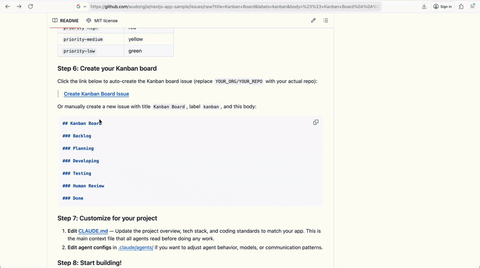

# Collo.dev: Scrum Master Github AI Agent Template



## Why AI Needs a Scrum Master

AI coding agents are powerful — they can plan features, write code, and run tests. But without coordination, they become chaotic. Multiple agents working on the same codebase need someone to break down work, assign tasks, track progress, and ensure nothing falls through the cracks.

That's exactly what a human Scrum Master does for a development team. This project replaces that role with an **AI Scrum Master** that runs entirely on GitHub:

- **Breaks down your ideas** into discrete, prioritized backlog tickets
- **Assigns work** to specialized AI agents (planner, developer, tester)
- **Tracks progress** on a Kanban board that updates automatically
- **Keeps humans in the loop** at every decision point

The result: you describe what you want to build, and a coordinated team of AI agents builds it — with full visibility and human oversight at every stage.

## How It Works

Four specialized Claude AI agents collaborate through GitHub Actions, coordinated by the Scrum Master:

```
You describe a feature → Scrum Master creates tickets → Planner designs it →
Developer builds it → Tester validates it → You review & merge
```

| Agent             | Role                                                                |
| ----------------- | ------------------------------------------------------------------- |
| **Scrum Master**  | Manages Kanban board, creates tickets, assigns work, tracks status  |
| **Planner**       | Analyzes feature requests, creates detailed implementation plans    |
| **Fullstack Dev** | Implements features (frontend + backend), writes tests, creates PRs |
| **QA Tester**     | Reviews PRs, runs lint/tests/build, reports bugs or approves        |

Work flows through a Kanban board (a GitHub issue) with stages:

```
Backlog → Planning → Developing → Testing → Human Review → Done
```

The Scrum Master moves tickets between stages automatically as work progresses. You can see the full status of your project at any time by checking the Kanban board issue.

### The Workflow in Detail

1. **You comment** on the Kanban issue: `@scrum-master Create backlogs for user auth and dashboard`
2. **Scrum Master** breaks it into tickets, adds them to the Backlog
3. **You approve** a ticket: `approve User authentication`
4. **Scrum Master** creates a feature issue, triggering the **Planner**
5. **Planner** analyzes the request and posts an implementation plan
6. **You review** the plan and approve it
7. **Scrum Master** moves the ticket to Developing, **Fullstack Dev** starts coding
8. **Dev** pushes a feature branch, opens a PR to `develop`
9. **Scrum Master** moves the ticket to Testing, **QA Tester** reviews the PR
10. **Tester** runs lint, tests, build — reports bugs or approves
11. **You merge** the PR, **Scrum Master** marks the ticket as Done

## Your Role as a Human

You stay in control at key checkpoints:

| When            | What you do                                                |
| --------------- | ---------------------------------------------------------- |
| Backlog created | Review tickets, `approve <ticket>` the ones you want built |
| Plan created    | Review the implementation plan, add `approved-plan` label  |
| Tests pass      | Review the PR, merge to `develop`                          |
| Release ready   | Merge `develop` → `main` for production                    |

Everything else is automated. You can monitor progress on the Kanban board issue at any time.

## Quick Start: Use This Template

### Step 1: Fork or clone this repo

```bash
git clone https://github.com/YOUR_USERNAME/nextjs-app-sample.git
cd nextjs-app-sample
```

Or click **"Use this template"** on GitHub to create your own repo from this template.

### Step 2: Add your Claude API token

You can use **either** of these authentication methods:

**Option A: Claude Code OAuth Token (if you are Pro or Max user, generate this by running claude setup-token locally)**

1. Go to your GitHub repo → **Settings** → **Secrets and variables** → **Actions**
2. Click **New repository secret**
3. Name: `CLAUDE_CODE_OAUTH_TOKEN`
4. Value: Your Claude Code OAuth token
5. Click **Add secret**

**Option B: Anthropic API Key**

1. Go to your GitHub repo → **Settings** → **Secrets and variables** → **Actions**
2. Click **New repository secret**
3. Name: `ANTHROPIC_API_KEY`
4. Value: Your API key from [Anthropic Console](https://console.anthropic.com/)
5. Click **Add secret**
6. Update the workflow files in `.github/workflows/` to replace `CLAUDE_CODE_OAUTH_TOKEN` with `anthropic_api_key` in the claude-code-action config

### Step 3: Install the Claude GitHub App

1. Go to [https://github.com/apps/claude](https://github.com/apps/claude)
2. Click **Install**
3. Select your repository (or all repositories)
4. This enables Claude to interact with your issues and PRs directly

### Step 4: Set workflow permissions

1. Go to **Settings** → **Actions** → **General**
2. Under **Workflow permissions**, select **Read and write permissions**
3. Check **Allow GitHub Actions to create and approve pull requests**
4. Save

### Step 5: Create the required labels

Go to **Issues** → **Labels** and create these:

| Label                   | Color suggestion |
| ----------------------- | ---------------- |
| `kanban`                | blue             |
| `feature-request`       | teal             |
| `awaiting-human-review` | yellow           |
| `needs-revision`        | light yellow     |
| `approved-plan`         | green            |
| `bugs-found`            | red              |
| `tests-passed`          | green            |
| `ready-for-merge`       | green            |
| `needs-clarification`   | yellow           |
| `priority-high`         | red              |
| `priority-medium`       | yellow           |
| `priority-low`          | green            |

### Step 6: Create your Kanban board

Click the link below to auto-create the Kanban board issue (replace `YOUR_ORG/YOUR_REPO` with your actual repo):

> **[Create Kanban Board Issue](https://github.com/YOUR_ORG/YOUR_REPO/issues/new?title=Kanban+Board&labels=kanban&body=%23%23+Kanban+Board%0A%0A%23%23%23+Backlog%0A%0A%23%23%23+Planning%0A%0A%23%23%23+Developing%0A%0A%23%23%23+Testing%0A%0A%23%23%23+Human+Review%0A%0A%23%23%23+Done)**

Or manually create a new issue with title `Kanban Board`, label `kanban`, and this body:

```markdown
## Kanban Board

### Backlog

### Planning

### Developing

### Testing

### Human Review

### Done
```

### Step 7: Customize for your project

1. **Edit [CLAUDE.md](CLAUDE.md)** — Update the project overview, tech stack, and coding standards to match your app. This is the main context file that all agents read before doing any work.
2. **Edit agent configs** in [.claude/agents/](.claude/agents/) if you want to adjust agent behavior, models, or communication patterns.

### Step 8: Start building!

Comment on your Kanban board issue to tell the Scrum Master what to build:

```
@scrum-master Create backlogs for a task management app with user authentication,
dashboard, CRUD for tasks, drag-and-drop reordering, and search/filter
```

The Scrum Master will break this down into backlog tickets on the board. Then:

1. **Approve a ticket**: Comment `approve <ticket-title>` on the Kanban issue
2. **Review the plan**: The Planner creates a plan on the feature issue — review it, then add `approved-plan` label and comment `@fullstack-dev please implement`
3. **Watch it build**: The Fullstack Dev implements the feature and opens a PR
4. **Auto-tested**: The QA Tester reviews the PR, runs tests, and reports results
5. **Merge**: When tests pass, review the PR and merge to `develop`

The Kanban board updates automatically at every stage.

## Stack-Agnostic Design

This template works with **any tech stack**. The agents read [CLAUDE.md](CLAUDE.md) to discover your project's:

- Framework and language
- Build, test, and lint commands
- Project structure and conventions
- Dependencies and how to install them

Just edit [CLAUDE.md](CLAUDE.md) to describe your stack — whether it's Next.js, Django, Rails, Flutter, Go, Rust, or anything else — and the agents will adapt.

## Git Workflow

- `main` — Production (stable, deployed)
- `develop` — Development (integration branch)
- `feature/*` — Feature branches (created by AI from `develop`)

All PRs target `develop`. Only humans merge `develop` → `main`.

## Customization

### Change the tech stack

Edit [CLAUDE.md](CLAUDE.md) to describe your actual tech stack. The agents read this file before every task, so keeping it accurate ensures they write code that fits your project.

### Adjust agent behavior

Agent configs live in [.claude/agents/](.claude/agents/):

- `scrum_master.md` — Board management and coordination
- `product_manager.md` — Feature analysis and planning
- `fullstack_dev.md` — Code implementation
- `tester.md` — Code review and testing

### Change AI models

Each workflow specifies a model in `claude_args`. You can change these in the [.github/workflows/](.github/workflows/) files:

- `claude-opus-4-6` — Most capable, used for planning and coordination
- `claude-sonnet-4-6` — Fast and cost-effective, used for implementation and testing

### Add more agents

To add a new agent (e.g., a dedicated API developer):

1. Create `.claude/agents/your_agent.md` with YAML frontmatter
2. Create a workflow in `.github/workflows/` that triggers the agent
3. Update [CLAUDE.md](CLAUDE.md) to document the new agent's role

## Documentation

- [CLAUDE.md](CLAUDE.md) — Project context, tech stack, and coding standards
- [WORKFLOW_SETUP.md](WORKFLOW_SETUP.md) — Detailed setup and architecture guide
- [COMMUNICATION_PROTOCOL.md](COMMUNICATION_PROTOCOL.md) — How agents communicate and hand off work

## Cost

Each workflow run consumes Claude API tokens. To manage costs:

- Opus is used sparingly (planning, Scrum Master coordination)
- Sonnet handles implementation and testing (lower cost)
- Adjust `--max-turns` in workflow files to limit conversation length
- Monitor usage at [console.anthropic.com](https://console.anthropic.com/)

---

**Don't want to configure GitHub Actions and labels manually?** We're building [Collo.dev](https://collo.dev) — a fully hosted GitHub App that installs this entire AI Scrum team in one click with zero setup. [Join the waitlist.](https://collo.dev)
